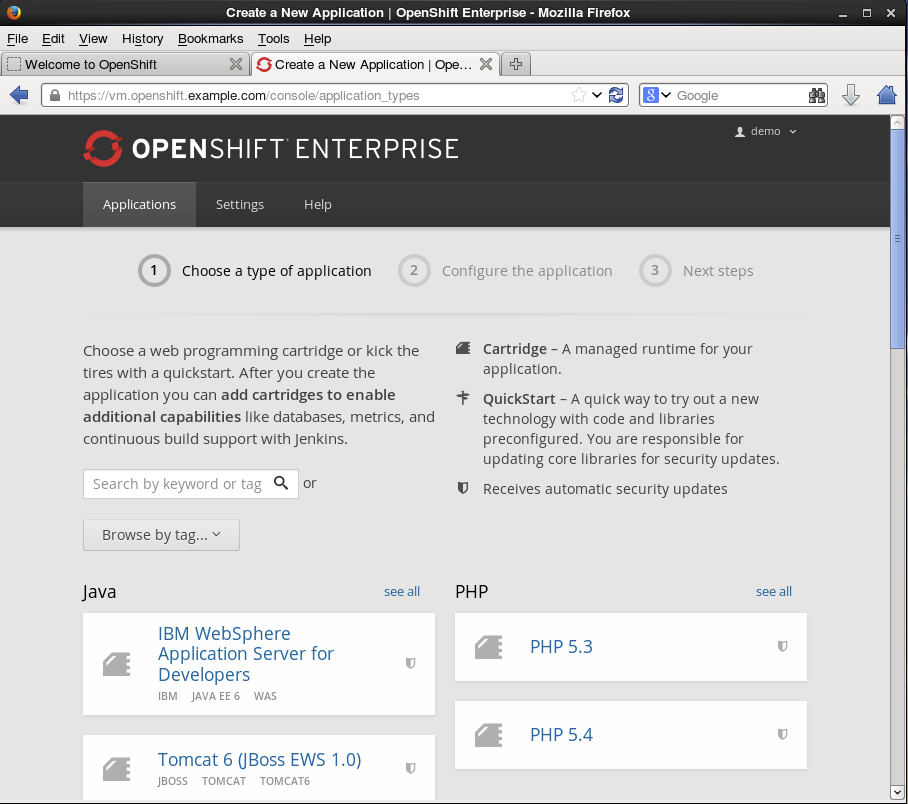
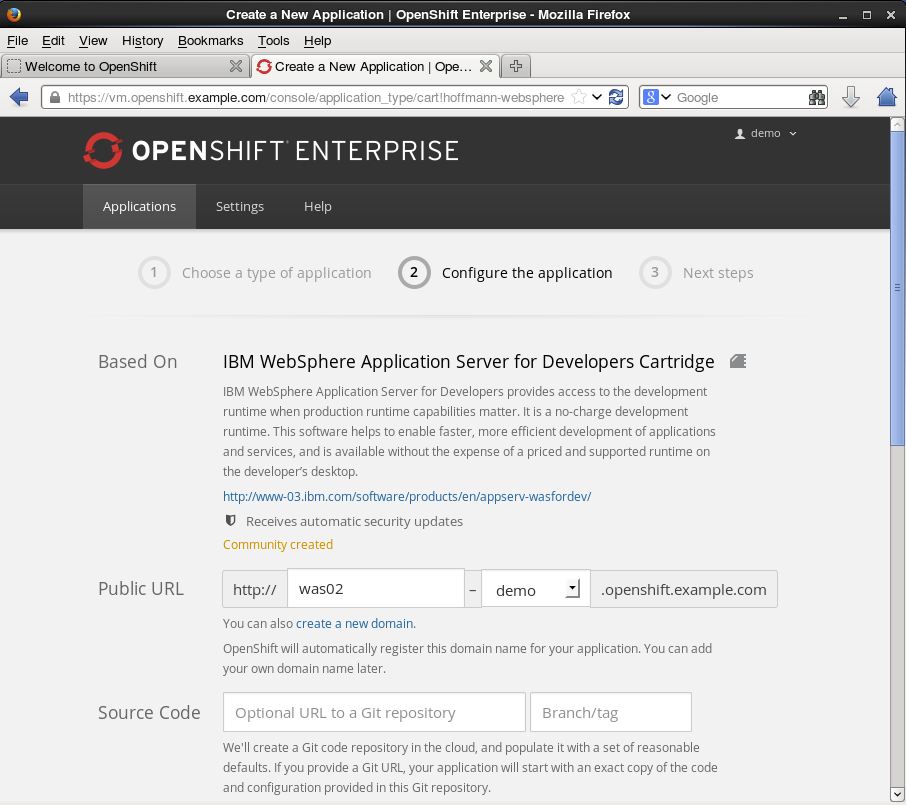
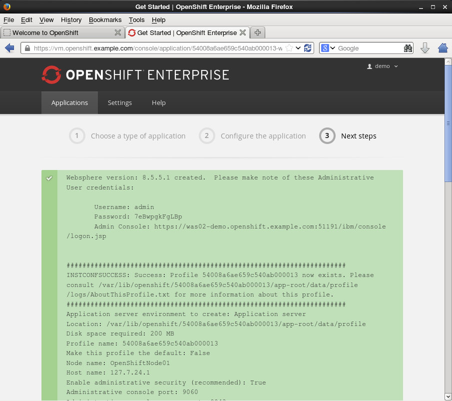
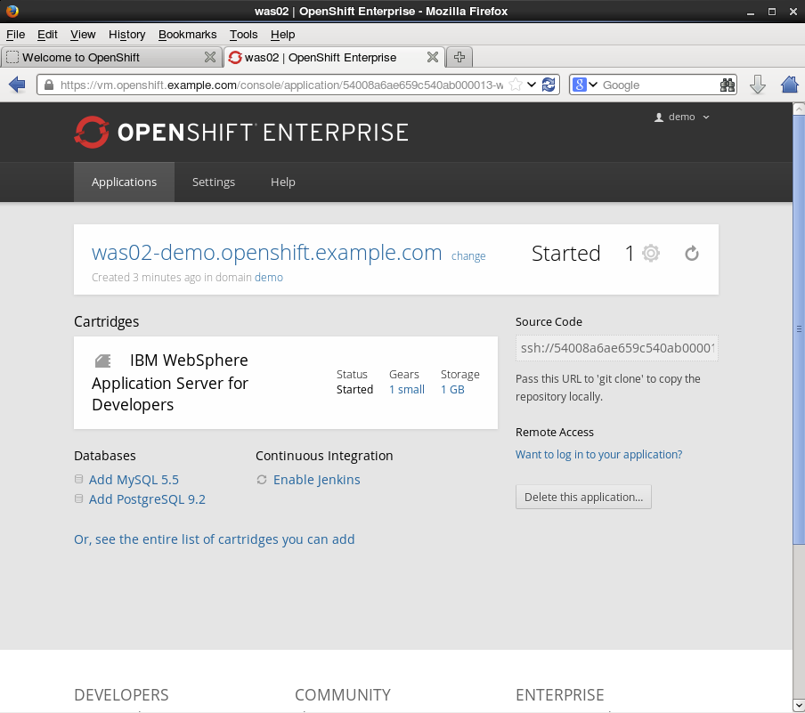
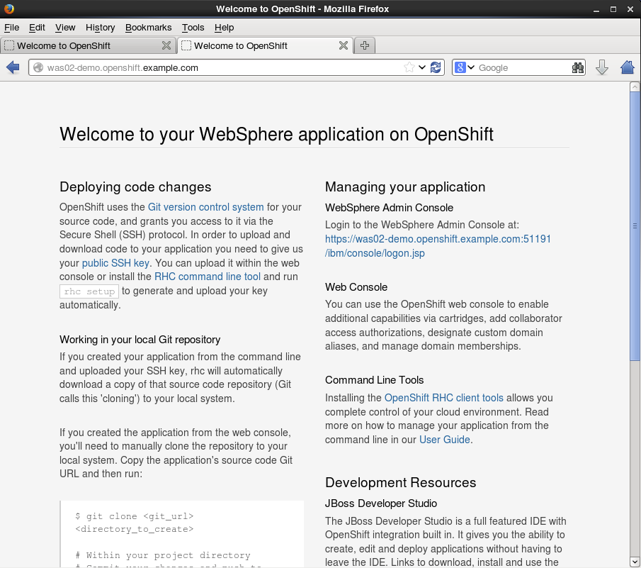
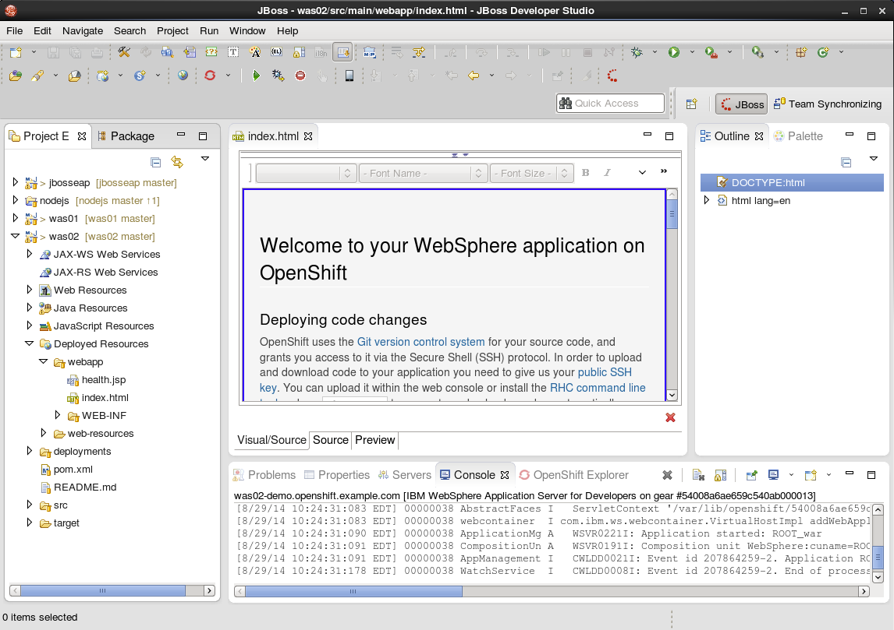

IBM WebSphere Application Server on OpenShift Handbook
======================================================

A. Synopsis
===========

What this is about
------------------
We've created a IBM WebSphere Application Server cartridge in order to demonstrate the power and flexibility of Red Hat's Open Hybrid Cloud strategy. The main focus for this cartridge is OpenShift Enterprise (https://www.redhat.com/de/technologies/cloud-computing/openshift). At this point in time this cartridge can be considered rather as a Proof of Concept cartridge, as its sole purpose is to show that an integration is indeed possible.

The cartridge currently supports the following features:

* Provisioning of new IBM WebSphere Application Server instance in minutes
* Full build & Deploy life cycle (as with EAP cartridge)
* Hot Deployment
* Jenkins Integration
* Integration into JBoss Developer Studio

The source code can be found here: https://github.com/juhoffma/openshift-origin-websphere-cartridge


Screenshots
------------------













B. Installation
===============
 
1. Setup OSE Environment
------------------------
You have the following deployment options for this cartridge:

* OpenShift Origin developer image (http://openshift.github.io/documentation/oo_deployment_guide_vm.html)
* OpenShift Enterprise developer image (https://rhn.redhat.com/rhn/software/channel/downloads/Download.do?cid=21355)
* Standalone installation of Red Hat OpenShift Enterprise.

 
2. WebSphere Application Server Installation
--------------------------------------------

### IMPORTANT NOTES
In contradiction to the deployment model of other cartridges (that includes all binaries of a certain technology), we've decided not to put the installation files into the cartridge. The reasoning behind:

* IBM WebSphere Application Server Binaries are very large (around 2-3 GB)
* Installation process for the binaries takes takes a long time (up to 15 minutes according to the computing resources)


### Binary Installation
The following steps will take you through the installation steps for IBM WebSphere Application Server for Developers:

```
# Install Installation Manager + WebSphere Application Server for Developers
unzip DEVELOPERSILAN.agent.installer.linux.gtk.x86_64.zip

# Replace install.xml
# You can find a sample "install.xml" here https://github.com/juhoffma/openshift-origin-websphere-cartridge/tree/master/usr/doc/install.xml

 # Create key files (for connection to IBM download site)
cd tools
touch secureStorage
touch masterPassword
vi masterPassword

# Insert your own IBM ID
./imutilsc saveCredential -passportAdvantage -userName <IBMID_USERNAME> -userPassword <IBMID_PASSWORD> -secureStorageFile ./secureStorage -masterPasswordFile ./masterPassword

# Start installation (you must be root)
su -
./installc -log /tmp/ibm_installation_manager.log -acceptLicense -masterPasswordFile ./tools/masterPassword -secureStorageFile ./tools/secureStorage
```

### Non-Root permissions
In order to create profiles by non-root users, special file permission settings have to be set on your WebSphere installation. Please follow the steps described here: http://www-01.ibm.com/support/knowledgecenter/SS7JFU_8.5.5/com.ibm.websphere.express.doc/ae/tpro_nonrootpro.html?lang=en

 

### Installation Result
After successfully executing the above steps you have installed the following components:

* IBM Installation Manager - /opt/IBM/InstallationManager
* WebSphere Application Server - /opt/IBM/WebSphere/AppServer


3. Customize SELinux Configuration
----------------------------------
Since IBM WebSphere Application is installed outside of the gear's sandbox, you need to customize SELinux permission settings in a way that the installation directory "/opt/IBM/WebSphere/AppServer" can be accessed with read/write.

As a workaround and/or for testing purposes you could also temporarily disable SELinux policy enforcement:
```
setenforce 0
```


4. Cartridge Installation
-------------------------
The cartridge can be installed as any other  OSE cartridge. However, you MUST have to make sure that WebSphere Application Server has been installed before (as described in the preceding sections):

On each OpenShift node execute the following commands:
```
cd /usr/libexec/openshift/cartridges
git clone https://github.com/juhoffma/openshift-origin-websphere-cartridge.git
oo-admin-cartridge --action install --recursive --source /usr/libexec/openshift/cartridges
oo-admin-ctl-cartridge --activate -c import-node --obsolete
oo-admin-broker-cache --clear && oo-admin-console-cache --clear
```

 
B. Administration and configuration
===================================

Configure a custom installation location for IBM WebSphere Application Server
-----------------------------------------------------------------------------
This cartridge needs an existing installation of the WebSpehere Application Server on each of your nodes. You need to define the location of the installation through a system wide environment variable 

```
echo "/opt/IBM/WebSphere/AppServer" > /etc/openshift/env/OPENSHIFT_WEBSPHERE_INSTALL_LOCATION
```

this will make sure that the cartridge finds the necessary components.


Configure non-root file permissions
-----------------------------------
The file permissions of your WebSphere installation must be set to allow non-root profile creation (see official IBM documentation: http://www-01.ibm.com/support/knowledgecenter/SS7JFU_8.5.5/com.ibm.websphere.express.doc/ae/tpro_nonrootpro.html?lang=en). This has to be done once per binary installation. You can use the following script as a basis for automating this: "usr/setWebSpherePermissionsForNonRootProfileCreation.sh"


How profile creation works
--------------------------
This cartridge will call `${OPENSHIFT_WEBSPHERE_DIR}/install/bin/manageprofiles.sh` and create a profile with the name ${OPENSHIFT_APP_NAME}. The profile will be created underneath the `profile` directory inside your gears `data` directory. 

The profile will have security enabled. An admin `username` and a `password` are generated at the time of creation and the `PerfTuningSetting` will be set to development.


Access to WebSphere Admin Console
---------------------------------
PREFFERED - Option 1) After you have created your gear, do a `rhc port-forward <GEAR_NAME>` and open a browser with the following URL `https://<YOUR_LOCAL_IP>:9043/ibm/console`.

Option 2) The Admin Console is also exposed via a separate external port that can be determined as follows:

```
rhc ssh <GEAR_NAME>
export | grep WC_ADMINHOST_SECURE_PROXY_PORT
```

Now point your browser to the following URL: `https://<GEAR_DNS>:<WC_ADMINHOST_SECURE_PROXY_PORT>/ibm/console/logon.jsp` and enter your credentials. Unfortunately the Admin Console tries to redirect us to the local port 9043. That is why we have to enter the following URL manually: `https://<GEAR_DNS>:<WC_ADMINHOST_SECURE_PROXY_PORT>/ibm/console/login.do?action=secure`.


Hot Deployment
--------------
Hot Deployment is accomplished by using WebSphere's "Monitored Directory Deployment" feature (see official documentation here: http://www-01.ibm.com/support/knowledgecenter/SS7JFU_8.5.5/com.ibm.websphere.express.doc/ae/urun_app_global_deployment.html?lang=en). In order to deploy an EAR just put it in the following directory: `app-root/data/profile/monitoredDeployableApps/servers/server1`.

In addition to this you can also Jenkins as a build server for your application. Just login to your OpenShift Console, select your WebSphere application and click `Enable Jenkins`. This will create a new Jenkins job for your application that will be triggered after each GIT push to your OpenShift instance.


C. Reference Information
========================

WebSphere specific
------------------
* Command reference "manageprofiles.sh" - http://pic.dhe.ibm.com/infocenter/wasinfo/v8r5/topic/com.ibm.websphere.express.doc/ae/rxml_manageprofiles.html
* Disable Security HTTPS for Web App - http://www-01.ibm.com/support/docview.wss?uid=swg21408274
* Configure WebSphere to bind to specific IP - http://www-01.ibm.com/support/knowledgecenter/SSAW57_8.5.5/com.ibm.websphere.nd.doc/ae/trun_multiplenic.html?lang=en
* WebSphere Global Deployment Settings - http://www-01.ibm.com/support/knowledgecenter/SS7JFU_8.5.5/com.ibm.websphere.express.doc/ae/urun_app_global_deployment.html?lang=en
* WebSphere Auto Deployment - http://www.webspheretools.com/sites/webspheretools.nsf/docs/WebSphere%208%20Auto%20Deploy
* File Permissions for non-admin install - http://www-01.ibm.com/support/knowledgecenter/SS7JFU_8.5.5/com.ibm.websphere.express.doc/ae/tpro_nonrootpro.html?lang=en


OpenShift specific
------------------
* Cartridge Developers Guide - http://openshift.github.io/documentation/oo_cartridge_developers_guide.html
* How to expose more than one public port - https://github.com/sosiouxme/diy-extra-port-cartridge/tree/ssl-hack and https://www.openshift.com/content/at-least-one-port-for-external-use-excluding-8080-please
* WebSphere Liberty Cartridge - https://github.com/opiethehokie/openshift-liberty-cartridge


D. ToDo's
=========
 
- [ ] Work with managed profiles
- [ ] Support Marker Files for different JDK's
- [X] Enable Deployments through deployable apps
- [X] Provide a build lifecycle as with JBoss EAP cartridge
- [X] Provide an example app as with JBoss EAP cartridge
- [X] Integrate Server's SysOut log in development tooling